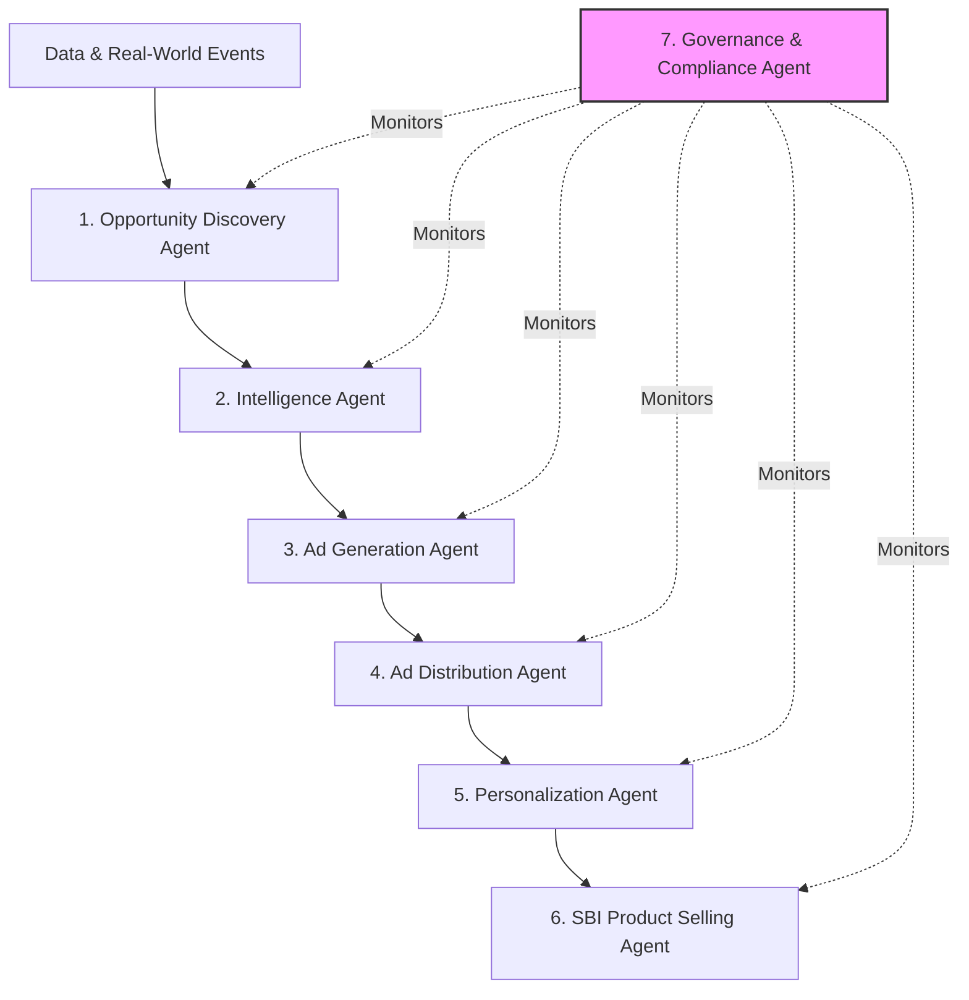
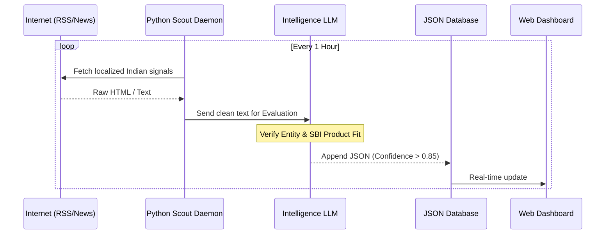

# SBI Autonomous Customer Acquisition Framework 🚀

**AI-powered Autonomous Banking Journey: From Opportunity Detection to Lifetime Customer Relationship**

*Global Fintech Fest 2026 | SBI Hackathon | Customer Acquisition Pillar*  
*By: Sree Ram Roshan A S*

---

## 📖 Problem Statement

Traditional customer acquisition mostly depends on reactive marketing campaigns, cold calls, and broad advertisements. Banks wait for customers to approach them. By the time a customer starts searching for a loan, they may have already chosen a competitor.

As a result, SBI spends more money on broad marketing campaigns, misses high-value customer opportunities, and follows a fragmented onboarding process.

## 💡 Our Solution: The Vision

Instead of waiting for customers, we propose an **AI-powered Autonomous Customer Acquisition Framework** that proactively identifies customer opportunities from real-world events, understands their financial needs, and engages them through personalized interactions.

The framework is built using multiple specialized AI agents that work together to:
**Discover → Understand → Engage → Qualify → Convert**

### The 7-Agent Swarm Architecture



---

## 🚀 What We Have Built Right Now (Phase 1)

For this hackathon submission, we have successfully developed and deployed the foundational backend pipeline: **The Opportunity Discovery & Intelligence Engine**.

It runs as a 100% autonomous background Python daemon that sweeps the internet, evaluates financial signals using a massive open-source LLM, and populates a real-time Vanilla UI dashboard.

### 1. The Autonomous Scouts (`src/scouts/`)

- **EduScout:** Tracks student admissions, exam counseling dates, and visa regulations to map opportunities for *SBI Scholar Loans*.
- **CorpScout:** Tracks manufacturing expansions, startup funding, and government (NHAI) tenders to map opportunities for *SBI Project Finance* and *Bank Guarantees*.

### 2. The Chain-of-Thought Intelligence Engine (`src/engine.py`)

To prevent AI hallucinations, our Engine utilizes an **Entity-Intent Triangulation** prompt. It mathematically classifies the entity (B2B vs. Retail), identifies the beneficiary, and maps the exact SBI product using deterministic business logic via the `openrouter/free` LLM API.

### 3. Real-Time Command Dashboard (`dashboard/`)

A lightweight, locally hosted web interface that polls our local JSON database (`opportunities.json`) every 5 seconds, displaying high-confidence banking leads in a clean, lavender and sea-blue interface.



---

## 💻 How to Access and Run the Prototype

This project is lightweight and does not require heavy SQL databases or complex frontend frameworks.

### Prerequisites

- Python 3.10+
- An OpenRouter API Key

### Installation

1. Clone the repository and navigate to the project folder.
2. Install the required dependencies:

```bash
pip install requests beautifulsoup4 apscheduler python-dotenv
```

3. Create a `.env` file in the root directory and add your OpenRouter key:

```text
OPENROUTER_API_KEY=your_api_key_here
```

### Execution

You need two terminal windows to run the agent and the dashboard simultaneously.

**Terminal 1: Start the Dashboard**

```bash
python dashboard/server.py
```

Open `http://localhost:8000` in your browser.

**Terminal 2: Start the Agent**

```bash
python main.py
```

The autonomous cycle will begin, fetching real-time signals and pushing them to the dashboard.

---

## 🗺️ Future Plans (Phases 2 & 3)

1. **Ad Generation & Distribution:** Integrating AI to automatically craft regional language marketing copy based on the specific intelligence gathered by our Scouts.
2. **Trust-First Personalization Agent:** Developing a conversational UI that provides value first (e.g., sharing Visa guides or University details) before asking for sensitive loan data.
3. **SBI Product Selling Agent:** Secure Aadhaar/DigiLocker integration to auto-fill applications based on verified data.
4. **Governance Guardrails:** Implementing a strict monitoring layer to ensure all AI interactions adhere to RBI digital lending guidelines, AML/PMLA rules, and the DPDP Act of 2023.

*Built on Trust. Guided by Intelligence. Empowering India.*

---

## 🎥 Hackathon Reference

[SBI Hackathon 2026 is Here](https://www.youtube.com/shorts/ceh_8CrRFEw)

This video provides an overview of the specific hackathon themes regarding digital adoption and Agentic AI solutions that this framework is designed for.
